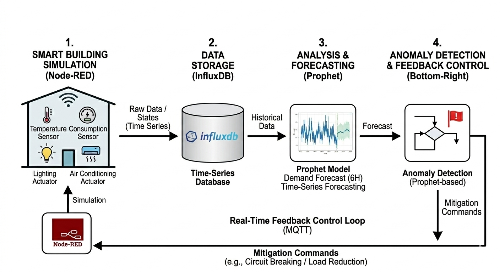
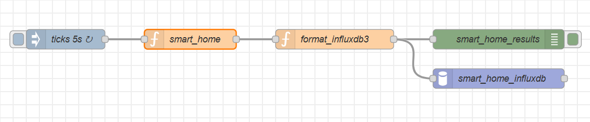
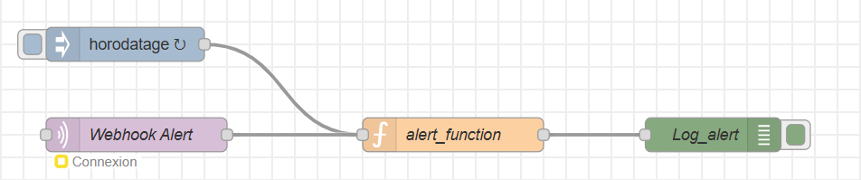
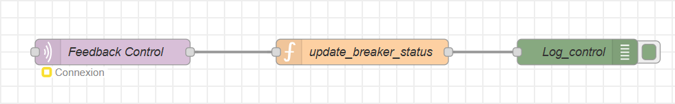

# AI-Driven Smart Energy Management in IoT-Enabled Buildings

This repository contains the full implementation of an intelligent energy management system for smart buildings. The project integrates multi-agent simulation, time-series data storage, AI-powered forecasting, and real-time automated feedback control[cite: 1].

## System Architecture

The architecture follows a four-stage pipeline designed for efficiency and scalability in embedded systems[cite: 1]:



1.  **Smart Building Simulation**: Realistic modeling of 6 residential zones (Kitchen, Living Room, etc.) with automated load cycles and anomaly injection via Node-RED[cite: 1, 4].
2.  **Data Storage**: Time-series data management using InfluxDB with optimized retention policies[cite: 1].
3.  **Analysis & Forecasting**: Predictive modeling using Facebook Prophet to anticipate energy demand over a 6-hour horizon[cite: 1, 2].
4.  **Anomaly Detection & Feedback**: Real-time mitigation loop using MQTT to isolate circuits during power spikes[cite: 1, 3].

---

## Implementation Details

### Node-RED Flows
The simulation and communication backbone is built on Node-RED. The flows manage the data ingestion and the hardware-in-the-loop simulation[cite: 4].

**1. Main Simulation Flow**
This flow simulates the 5-second tick data for the entire building and formats it for InfluxDB[cite: 1, 4].


**2. Webhook & Alerting System**
Handles external triggers and logs anomalies identified by the Python analysis scripts[cite: 1, 4].


**3. Feedback Control Loop**
Receives mitigation commands via MQTT to update virtual circuit breaker statuses in real-time[cite: 3, 4].


---

## Getting Started

### Project Structure
```text
├── scripts/
│   ├── forecast.py                  # Prophet training & inference
│   ├── feedback_control.py          # MQTT real-time control logic
│   └── peaks_alert.py               # Seasonal threshold calculation
├── img/                             # Architecture and flow diagrams
├── requirements.txt                 # Python dependencies
└── README.md
```

### Prerequisites
*   Python 3.8+
*   Node-RED
*   InfluxDB 3.0
*   MQTT Broker (e.g., Eclipse Mosquitto)

### Installation
1.  **Clone the repository**:
    ```bash
    git clone [https://github.com/your-username/smart-energy-mgmt-ai-iot.git](https://github.com/your-username/smart-energy-mgmt-ai-iot.git)
    
```
2.  **Install Python dependencies**:
    ```bash
    pip install -r requirements.txt
    ```
3.  **Import Node-RED Flow**:
    *   Open Node-RED.
    *   Import `flows/energy-management-flow.json`.
    *   Deploy the flow.

---

## Research Highlights
*   **Seasonal Dynamics**: The system applies dynamic thresholds: $Winter \times 1.5$, $Mid-season \times 1.2$, and $Summer \times 1.0$[cite: 2].
*   **Performance**: Total reaction latency (detection to mitigation) is maintained between **5–10 seconds**[cite: 1].
*   **Efficiency**: Global memory footprint remains under **350 MB**, making it suitable for edge gateways[cite: 1].

## Publication
This work was presented and published in the **Sciences Methods and Technologies International Journal (SciMeTech)**, ISSN: 3085-5284[cite: 1].

## License
This project is licensed under the **MIT License**.
```
